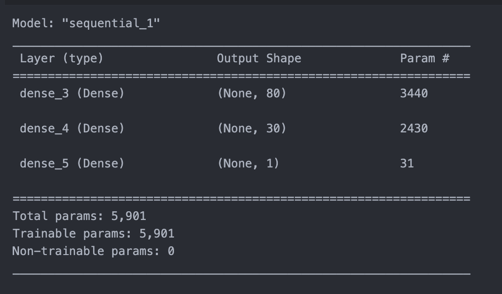
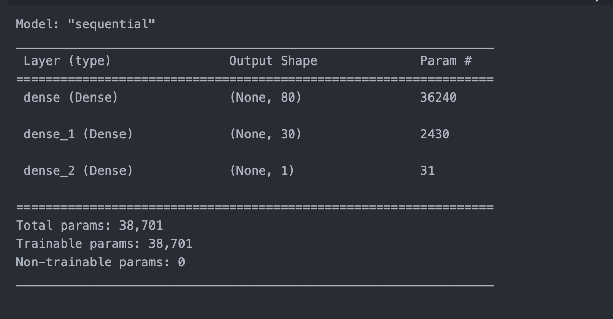
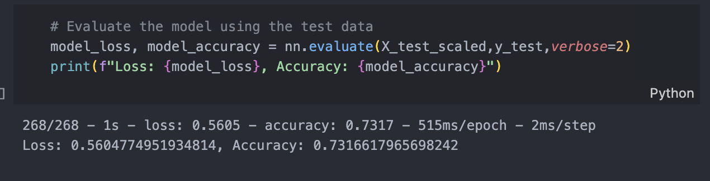
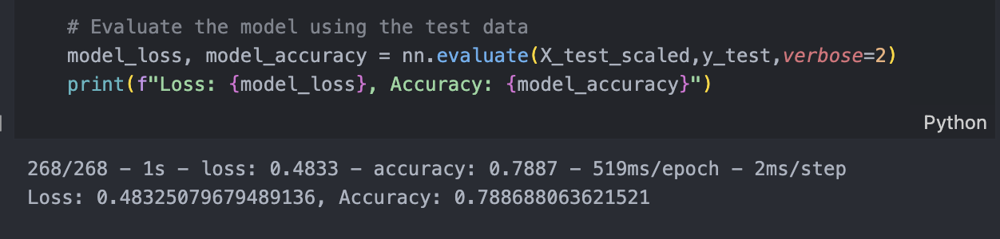

## **Overview** of the analysis

The purpose of the project is to develop a machine learning model that acts as a binary classifier. By using this dataset and leveraging machine learning techniques, the aim is to use the model that can effectively predict whether an applicant will be successful if funded by Alphabet Soup. 

## **Results**

* Data Preprocessing

  * What variable(s) are the target(s) for your model?
    * The target variable for the model is `IS_SUCCESSFUL` It is a binary variable indicating whether the money provided by Alphabet Soup was used effectively (1) or not (0).
  * What variable(s) are the features for your model?
    * The feature variables for the model are `APPLICATION_TYPE` and `CLASSIFICATION` in the dataset.
  * What variable(s) should be removed from the input data because they are neither targets nor features?
    * The variables that should be removed from the input data are the identification columns (EIN and NAME) as they do not contribute to the model's predictive power.
* Compiling, Training, and Evaluating the Model

  * How many neurons, layers, and activation functions did you select for your neural network model, and why?

    * Number of neurons: The number of neurons in the first hidden layer is 80 (hidden_nodes_layer1), and the number of neurons in the second hidden layer is 30 (hidden_nodes_layer2).
    * Number of layers: The model has two hidden layers.
    * Activation functions: The activation function used in both the hidden layers is the Rectified Linear Unit (ReLU) activation function. The output layer uses the sigmoid activation function.
    * Reason: I took the ratio from the neurons number examples in course materials to begin with a relatively simple model architecture to establish a baseline. According to the example showing in class, two hidden layers and `ReLU` were used for similar size data. So I decided to do the same.
    * Before Optimized
      
    * After Optimized
      
  * Were you able to achieve the target model performance?

    * The 1st time result is around 73%.
    * In the optimization part, I were able to achieve the target model performance in `AlphabetSoupCharity_Optimization.ipynb`. Result is higher than 75%, around 79%
  * What steps did you take in your attempts to increase model performance?

    * Dropping fewer columns. I kept the `NAME `column.

## **Summary**

The deep learning model, a neural network with two hidden layers, was designed and trained to reach the required accuracy of funding applicants for Alphabet Soup. The model's architecture consisted of 80 neurons in the first hidden layer and 30 neurons in the second hidden layer, both using the ReLU activation function. The output layer utilized the sigmoid activation function for binary classification. And the result in second optimized version successfully reached to the accuracy(79%) more than the required one(75%).

##### Recommendation

I think this project for Alphabet Soup is a classification problem. So one consideration is Random Forest, which is a popular machine learning algorithm used for **classification and regression tasks:**

* due to its high accuracy, robustness, feature importance, versatility, and scalability.
* The data set in this project is pretty large. Random Forest reduces overfitting by averaging multiple decision trees and is less sensitive to noise and outliers in the data.

Reference: https://medium.com/@pandeypragati2112/svm-and-random-forest-a-case-study-6213da5be02f
